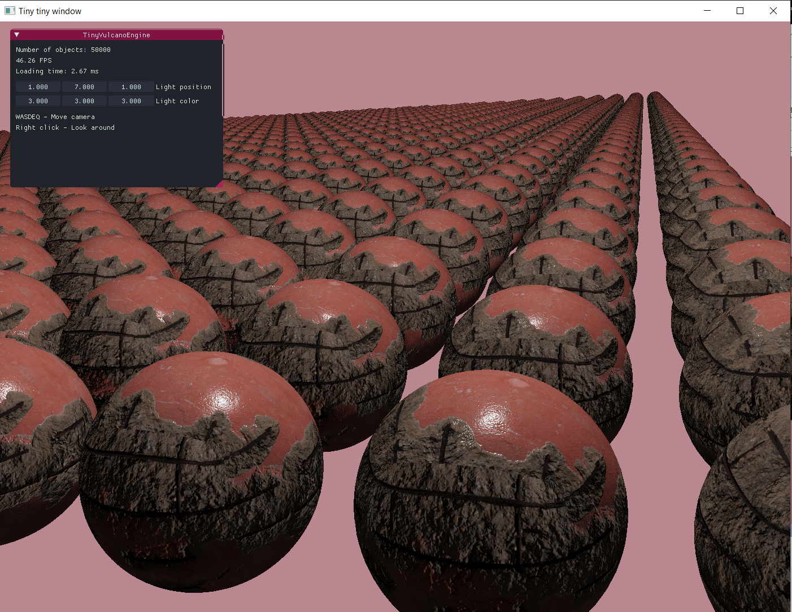
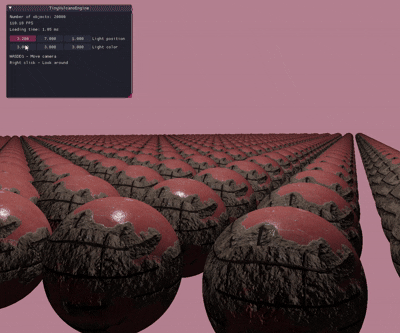

# tiny-vulcano-engine
My very own graphics engine built in C++ using the Vulkan API just to prove Vulkan is better than OpenGL, enjoyyy xD

## Showcase 

## Core functionalities
- [x] Model loading support via assimp
- [x]  Collision detection
- [x] Texture support
- [x] Camera & input system
- [x] ImGUI interface
- [x] PBR lighting model integration
- [x] Normal mapping
- [ ] Shadow mapping (to be continued)

## Showcase GIF

  

